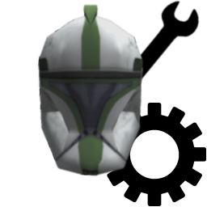
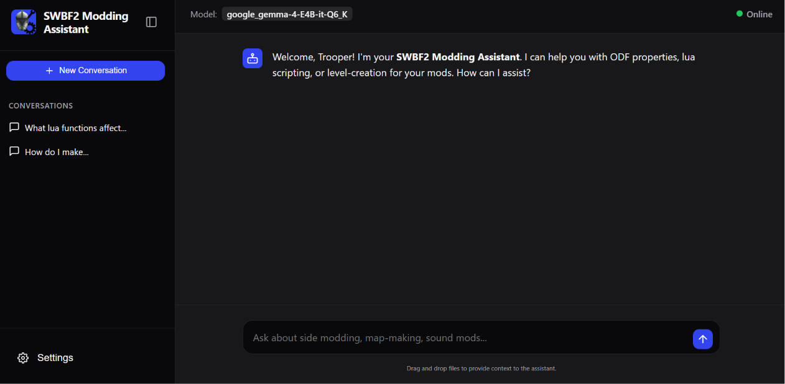

# swbf2-modding-assistant
A local AI assistant for modding Star Wars Battlefront II (2005). 

# 🛠️ Installation
- Simply download and extract the repo to your preferred directory. If placed in the BF2_Modtools directory, the assistant may be able to access your addon data folders.
- For Windows: Run Run_Assistant-Windows.bat as administrator once for environment setup, it can be run under normal privileges afterwards.
- For Linux/MacOS: Run Run_Assistant-Linux.sh with sudo once for environment setup, it can be run under normal privileges afterwards.
- Drop in any GGUF LLMs you wish that supports function-calling/tool-use into the models folder. Reccommend 2+ billion parameter models for best results. Higher parameter models may perform better, if your hardware can run them at a timely pace.

# 📝 Requirements
- Python
- Web Browser
- Bring your own GGUF LLM and drop it into the models folder. You may have several models and choose from them in the WebUI.
- The app will download an appropriate release of llama.cpp for your detected hardware on first startup. You may replace it with your own preferred release at any time, simply delete the automatically downloaded release and drop in your preferred release folder into the llama folder.

# ⚙️ Customization
The Settings modal of the WebUI offers several customization options:
- Dark Mode
- Font (Default, Orbitron, Aurebesh)
- Auto-Load Last Used Model on Startup
- Context-Length
- Model Selection
- Show Tool Calls
- Show AI Reasoning

As well as a few convenience features:
- Export Conversations
- Import Conversations
- Delete All Conversations

# 🚀 Usage
Simply run the batch script Run_Assistant-Windows.bat if on Windows, or the Run_Assistant-Linux.sh shell script if on Linux/MacOS. This will start the server and launch the WebUI in your default web browser.

From the Settings modal, select a model to load and set a context length. Both settings will be remembered by your browser, as will your conversations.

Your selected model will appear at the top of the page, and a spinner will appear while the model is loading or while the LLM is responding.

Once the model is loaded, you are free to chat with the LLM in the chat window. You may drag-and-drop files onto the window to attach them to your query.

At the top-right of the page is an Online/Offline label that simply reports whether llama-server.exe is running.

You may Edit your previous messages and delete them as well as delete AI messages. You can also rename or delete any conversation in the sidebar.

Note: Tools are required to at least allow the LLM to read documentation for context on BF2 modding. You MUST use an LLM that supports Tool-use/Function-calling.

The LLM is provided the following tools:
| Tool | Description |
| :--- | :--- |
| read_file(filePath) | Reads and returns the contents of the given file. |
| read_file_lines(filePath, startLine, endLine) | Reads and returns the contents of the given lines of the given file. |
| get_document_metadata(filePath) | Reads a summary of the document and a list of topics and their line numbers for a given file. |
| search_in_file(filePath, pattern) | Searches for and returns the first instance of a given regular expression in a given file. |
| edit_file(filePath, searchStr, replaceStr) | Replaces the first instance of a given string in a given file. |
| write_file(filePath, content) | Writes a file at the given path with the given contents. |
| list_files(dir) | Returns a list of all files and directories in a given directory. |
| run_batch_script(filePath) | Runs a given batch script and returns the output. |

# 📷 WebUI

